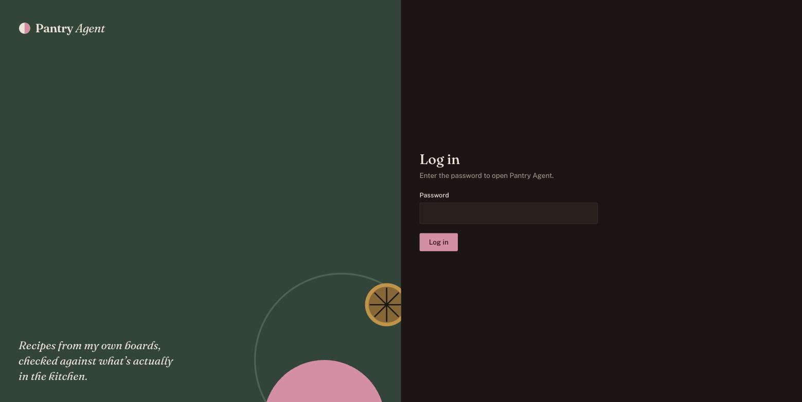
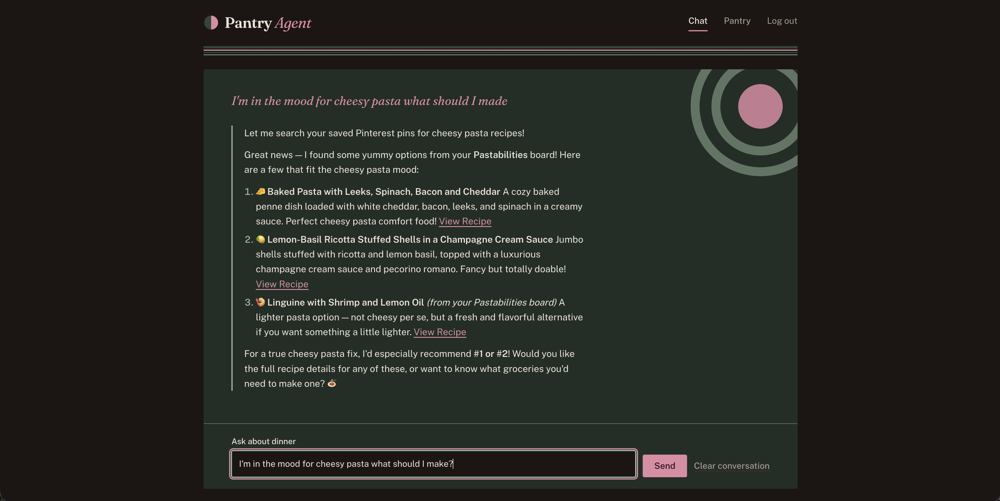
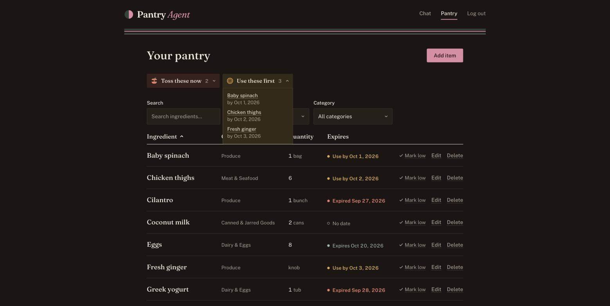

# Pantry Agent

[](https://github.com/JNC260/pantry-agent/actions/workflows/ci.yml)

An AI agent that answers "what can I make for dinner?" from my own Pinterest
boards. It checks each candidate recipe's real ingredient list rather than
guessing from the pin title, and falls back to the web when nothing I've
saved fits. Once I pick a recipe, it builds a grocery list against what's
actually in my pantry, including what's expired and what's running low.

It's a personal, single-user project: it reads my own Pinterest account
through Pinterest's API and isn't offered as a public service (see the
[privacy policy](./privacy.md), also at
[pantrywhisperer.com/privacy](https://pantrywhisperer.com/privacy)).





## What it does

- **Recommends recipes from my saved pins.** "I have chicken thighs and
  spinach" or "something with ginger": it shortlists pins, reads the actual
  recipes, and suggests up to three.
- **Falls back to the web** when nothing saved is a good match, and says so.
- **Answers follow-ups** about a recommended recipe (full steps, times)
  without looking the pin up again.
- **Builds a grocery list** for the recipe I choose: what I have enough of,
  what I might need more of, and what to buy, treating expired items as
  missing and flagging ones that are running low or expire soon.
- **Tracks the pantry** in a web UI: quantities, categories, expiry dates,
  low-stock flags, search, filters, and "use these first" reminders.

## Architecture

```
  web (Next.js)                 Login page, chat, and pantry management
      │  HTTPS + JWT
      ▼
  api (NestJS)                  Auth, pantry CRUD, relays chat to the agent
      │  HTTP, localhost only   ──────────► Turso: pantry database
      ▼
  pantry-agent (Mastra)         The agent, its tools, and sub-agents
      ├──► Pinterest API        Boards and pins (OAuth, rotating tokens)
      ├──► Tavily               Recipe page extraction and web search
      ├──► Anthropic            Claude Sonnet 4.6 and Haiku 4.5
      └──► Turso                Pinterest cache + token store; pantry (read-only)
```

Three npm workspaces, each with its own README:

| Workspace | Role |
| --- | --- |
| [`pantry-agent/`](./pantry-agent/README.md) | Mastra server: the chat agent, tools for Pinterest, recipe extraction, recommendations, and grocery lists, plus small single-purpose sub-agents |
| [`api/`](./api/README.md) | NestJS: password login issuing a JWT, pantry CRUD, and the only client of the agent server |
| [`web/`](./web/README.md) | Next.js: landing page, login, chat, and pantry pages |

**Why the agent server isn't public.** Mastra's generated HTTP API has no
authentication of its own. In production, `api` and `pantry-agent` run in the
same container (`start.sh`), and only `api` is exposed; it reaches the agent
over `localhost:4111`. So every agent call goes through the api's login.

**Why single-user.** Pinterest grants API access to my own account, and the
app exists to plan my meals, so there's no user table: one password (stored
as a bcrypt hash) issues a JWT for the one owner.

## Engineering notes

Some decisions worth calling out:

- **Verify before recommending.** A fast model (Haiku) shortlists up to five
  pins from titles and board names alone; each pick is then extracted to get
  its real ingredient list before it's recommended. If nothing fits, the tool
  returns nothing rather than a weak guess, which tells the agent to search
  the web instead.
- **Prompt caching.** The shortlist prompt lists every saved recipe pin, a couple of thousand of them. They're
  sorted into a stable order and sent as a cached block ahead of the
  per-request part, so repeat requests reuse the cache instead of paying for
  the whole list again.
- **Rotating OAuth tokens.** Pinterest issues a new refresh token on every
  refresh, so the latest one is persisted in the database. Concurrent
  requests share one in-flight refresh, and saving is compare-and-swap, so
  two processes sharing the database (local dev and production) can't
  clobber each other's tokens. A hash of the seed token detects when I've
  re-authorized and should start a fresh chain.
- **Resilient Pinterest access.** Requests retry once on a 401 (with a fresh
  token) or a server/network error; boards and pins fall back to stale cache
  when Pinterest is down; and a daily health check (`GET /health/pinterest`)
  keeps the token chain alive and surfaces a broken connection.
- **Cache that fills itself.** Boards and pins are cached for a week, fetched
  250 per page by following Pinterest's bookmarks. Recommendations lazily
  fetch recipe boards that were never cached, but never re-fetch one already
  checked.
- **Code decides facts, the model decides judgment.** For grocery lists,
  whether an item is expired or low is computed in code and handed to the
  model as a label; the model only judges equivalence ("chicken stock"
  covers "chicken broth") and rough sufficiency.
- **Dates without timezone bugs.** Expiry dates are `YYYY-MM-DD` strings
  parsed as local dates everywhere, with tests pinned to a late-evening
  "today" across several timezones.

## Running locally

Requires Node 22.13+ and npm.

```bash
npm install

# Environment: copy each example and fill it in
cp pantry-agent/.env.example pantry-agent/.env
cp api/.env.example api/.env
cp web/.env.example web/.env.local

# One time: authorize Pinterest and save a refresh token to pantry-agent/.env
npm run auth:pinterest -w pantry-agent

# Then, in three terminals:
npm run dev -w pantry-agent     # agent server + Mastra Studio, localhost:4111
npm run start:dev -w api        # localhost:3000
npm run dev -w web              # localhost:3001
```

For local databases, point `PANTRY_DB_URL` in both `api/.env` and
`pantry-agent/.env` at the same file (e.g. `file:../pantry.db`); the
Pinterest cache and Mastra storage default to local files when their URLs
are unset.

## Testing

```bash
npm test          # all unit and e2e tests
npm run typecheck # all three workspaces
```

About 90 tests cover Pinterest retries and token refresh, the recommendation
and grocery-list logic, date handling, the pantry UI's sorting, filtering and
form logic, and the api's auth, validation, and rate limiting (e2e against an
in-memory database). [CI](./.github/workflows/ci.yml) runs typecheck, lint,
tests, and all three builds on every push and pull request.

## Deployment

`api` and `pantry-agent` deploy together as one [Railway](https://railway.com)
service: once both are built, `start.sh` runs them side by side and exits if
either one stops, so Railway restarts the container. Railway's health check uses the
api's `GET /health`. The databases are on [Turso](https://turso.tech). `web`
is deployed on [Vercel](https://vercel.com) at
[pantrywhisperer.com](https://pantrywhisperer.com), built with
`NEXT_PUBLIC_API_URL` pointing at the api.

## License

[MIT](./LICENSE)
